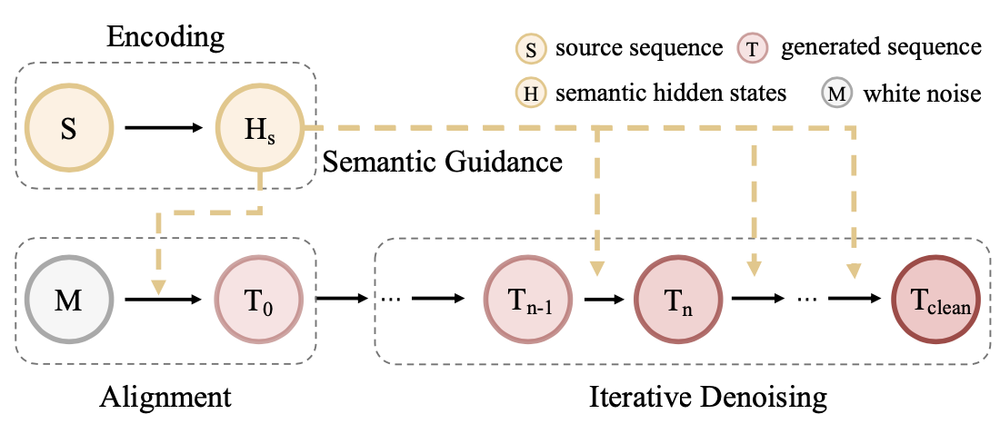
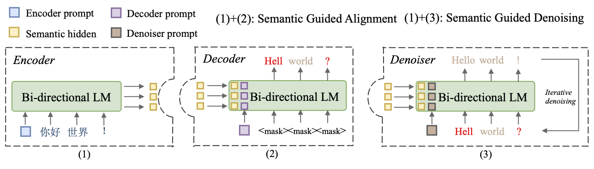
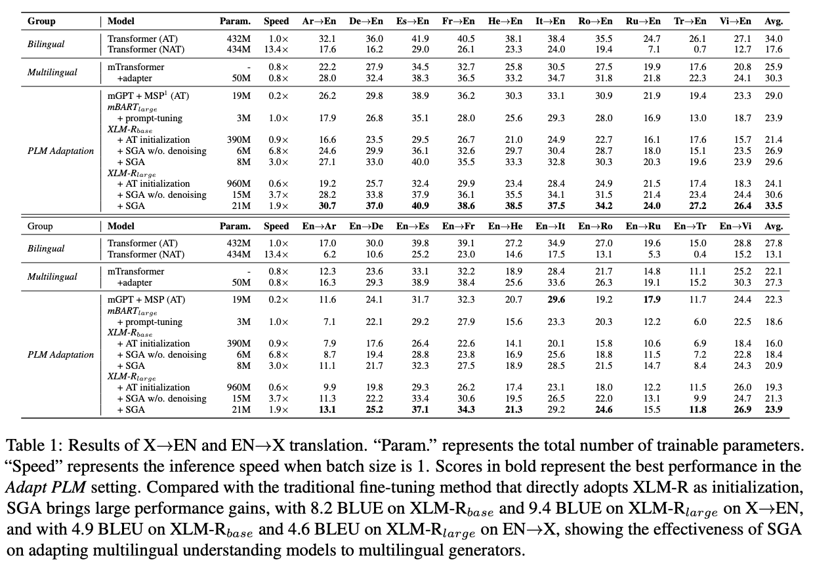

## Overview
Code for paper [Extrapolating Multilingual Language Understanding Models as Multilingual Language Generators](https://arxiv.org/pdf/2305.13140.pdf)
In this paper, we propose a **S**emantic **G**uided **A**lignmnt-then-Denoising (SGA) approach, which adapts a pretrained multilingual understanding model, XLM-R, to a non-autoregressive language generator in a parameter-efficient way.

Unrecovering a blank sentence to target translation bt iterative refinement


Main Architecture


## Requirements
- python == 3.7.11
- torch >= 1.9
- thumt == 1.2.0
- fairseq == 0.12.2
- transformers >= 4.27.1
- sentencepiece == 0.1.99

## Quick Start

### Preparing Dataset
Download TED dataset via

```
bash data/download_ML50_v1.sh
bash preprocess_ML50_v1.sh
```

### Training
`bash scripts/train.sh`

### Inference
`bash scripts/inference.sh`

## Results
We Update the results of mBART + prompt-tuning to show that XLM-R can achieve comparable performance with mBART in translation under the adaptation setting.



## Citation
```
@article{wu2023extrapolating,
  title={Extrapolating Multilingual Understanding Models as Multilingual Generators},
  author={Wu, Bohong and 
        Yuan, Fei and 
        Zhao, Hai and 
        Li, Lei and 
        Xu, Jingjing},
  journal={findings of EMNLP 2023},
  year={2023}
}
```